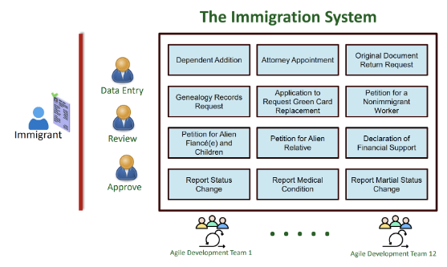
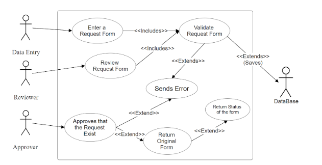
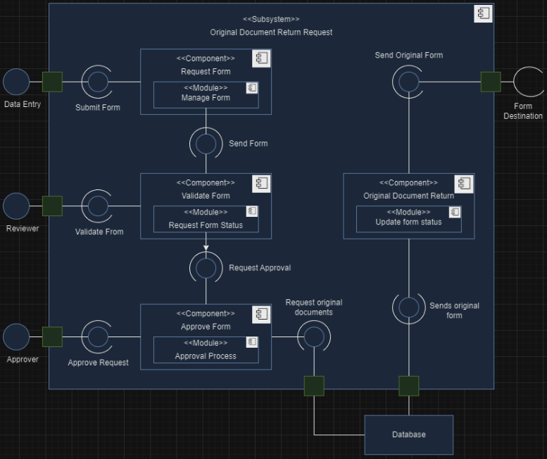
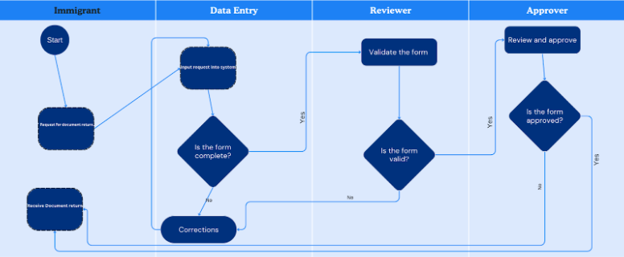

# original_document_return_request
A document return request component for a new immigration processing system. This is a group project for CS 321: Software Engineering at George Mason University

## Table of Contents
- [Concept](#concept)
- [Diagrams](#diagrams)
- [Installation](#installation)
- [Tech Stack](#tech-stack)
- [Project Structure](#project-structure)
- [Screenshots](#Screenshots)
- [License](#license)

## Concept

As a class we are developing a new immigration processing system following Agile methodology and each team is assigned a designated functional area within the system.

## Diagrams

This is our UML use case diagram representing the document return request component.


This is our UML Subsystem Component Diagram.


This is our UML activity diagram

## Installation
**Clone the repository:**
    ```bash
    git clone https://github.com/Ama4538/Original_Document_Return_Request.git
    cd original_document_return_request
    ```

## Tech Stack
- Java
- Maven

## Project Structure
```
├── git_images/         # Images used for readme
├── src/                # Source code
│   ├── main/           # All source files
│   ├── test/           # All unit tests
├── target/             # Complied Code and build output
├── app.js              # Main application file
├── .gitignore          # Git ignore file
├── .gitattributes      # All gits attributes
└── pom.xml             # Configuration file for Maven
```

## License
Distributed under the MIT License. See `LICENSE` for more information.